# Tenodera

<p align="center">
  
</p>

A self-hosted Linux server administration panel with real-time monitoring,
terminal access, and multi-host management — all from a single web interface.

```
Browser ──WSS──> Gateway (:9090) <──WS── tenodera-agent (remote host)
                                 <──WS── tenodera-agent (localhost)
```

No open inbound ports on managed hosts.
Each agent connects outbound to the gateway over a persistent WebSocket.

[](https://github.com/tenodera-io/tenodera/actions/workflows/ci.yml)


## Features

| Category | Capabilities |
|----------|-------------|
| **Dashboard** | CPU, RAM, swap, disk I/O, network I/O — real-time streaming charts |
| **Terminal** | Full PTY shell in the browser (xterm.js) |
| **Services** | systemd unit management — start / stop / restart / enable / disable; a failed action auto-expands the unit's `systemctl status` |
| **System** | Clock & timezone, time sync (chrony / timesyncd / ntpd / openntpd / PTP), hostname, locale & keyboard, power (reboot / shutdown, optional delay) |
| **Users & Groups** | User account CRUD, group management, lock/unlock, password policy |
| **Packages** | Installed packages, search, install, update, cache cleanup, repository management (apt, dnf, pacman); automatic updates (unattended-upgrades / dnf-automatic) |
| **Storage** | Block devices, mount points, I/O charts; mount / unmount + `/etc/fstab` editor; disk-usage browser (safe `du` drill-down) |
| **Networking** | Interfaces, traffic, firewall (ufw / firewalld / nftables), bridges, VLANs; listening ports (`ss`) with kill |
| **Containers** | Docker / Podman — containers, images, create, logs, exec (shell into a container), inspect |
| **SSH access** | authorized_keys per user (add / edit / remove, ssh-keygen validated); table-based `sshd_config` editor validated with `sshd -t` |
| **Security** | Auto-detects fail2ban (jails, ban/unban, reload), SELinux (enforce/permissive, booleans, AVC denials, modules, restorecon), AppArmor (per-profile enforce/complain) |
| **Files** | Remote file browser with sudo fallback |
| **Logs** | journald viewer with unit/priority filters |
| **Log Files** | Browse `/var/log` with keyword search and date/time range |
| **Audit log** | Table of actions taken through the panel (time, user, action, target, result) |
| **Cron Jobs** | List all crontab sources, view entries, edit raw crontab |
| **Kernel Dump** | kdump status, editable crash kernel config table, crash dump browser |
| **DNS** | `/etc/resolv.conf` and table-based `/etc/hosts` editing, DNS lookup, systemd-resolved |
| **Certificates** | TLS certificate scanning, view/edit PEM, trust store, self-signed generation, Let's Encrypt |
| **Multi-host** | Manage multiple servers from one panel via reverse-WebSocket agent |
| **Access control** | Admin (sudo/wheel users) — full access; other users — read-only |

## Install

Prebuilt, **signed packages** are the fastest way in — no compiling. They're
built for **Debian 12+ / Ubuntu 24.04+** (`.deb`, amd64 & arm64) and
**Fedora / RHEL** (`.rpm`, x86_64 & aarch64), and attached to every
[release](https://github.com/tenodera-io/tenodera/releases). Asset filenames
carry no version, so the `releases/latest/download/…` URLs always fetch the
newest release.

### 1. Panel host

Install the panel and the agent together.

**Debian / Ubuntu**

```bash
wget https://github.com/tenodera-io/tenodera/releases/latest/download/tenodera_amd64.deb
wget https://github.com/tenodera-io/tenodera/releases/latest/download/tenodera-agent_amd64.deb
sudo apt install ./tenodera_amd64.deb ./tenodera-agent_amd64.deb
```

**Fedora / RHEL** — `dnf` installs straight from the URL:

```bash
sudo dnf install \
  https://github.com/tenodera-io/tenodera/releases/latest/download/tenodera-x86_64.rpm \
  https://github.com/tenodera-io/tenodera/releases/latest/download/tenodera-agent-x86_64.rpm
```

The panel package configures itself (creates `/etc/tenodera/tenodera.cnf`, the
service account, and the data dir), enables and starts the gateway on port 9090,
and starts the local agent.

By default the gateway binds to **loopback only** (`127.0.0.1`), so a fresh
install is not exposed on the network. Reach it over an SSH tunnel:

```bash
ssh -L 9090:127.0.0.1:9090 <panel-host>
# then open http://localhost:9090 in your browser
```

Log in with any PAM system user that has `sudo` privileges. To serve the panel to
the network, front it with a TLS reverse proxy (recommended) or set
`TENODERA_BIND_ADDR=0.0.0.0` **after** enabling TLS — see
[DOCS.md](docs/DOCS.md) and [SECURITY.md](.github/SECURITY.md).

### 2. Managed hosts

Install just the agent.

**Debian / Ubuntu**

```bash
wget https://github.com/tenodera-io/tenodera/releases/latest/download/tenodera-agent_amd64.deb
sudo apt install ./tenodera-agent_amd64.deb
```

**Fedora / RHEL**

```bash
sudo dnf install https://github.com/tenodera-io/tenodera/releases/latest/download/tenodera-agent-x86_64.rpm
```

Then, on either distro, point the agent at your panel and start it:

```bash
sudo sed -i 's|127.0.0.1|<panel-host>|' /etc/tenodera/agent.cnf
sudo systemctl enable --now tenodera-agent
```

The agent connects outbound — no inbound ports needed. On first connect it waits
for approval; go to **Management → Pending** in the panel and click **Approve**.
To skip approval, generate a bootstrap token in **Management → Tokens** and pass
it with `--token` to the curl installer below.

> arm64 / aarch64: swap `amd64` → `arm64` (.deb) and `x86_64` → `aarch64` (.rpm).
> For a specific version, replace `latest` with the tag, e.g.
> `releases/download/v0.1.6/tenodera_amd64.deb`.

### 3. Verify the download

All artifacts are checksummed in `SHA256SUMS`, signed with
[minisign](https://jedisct1.github.io/minisign/). The public key is in
[SECURITY.md](.github/SECURITY.md):

```bash
wget https://github.com/tenodera-io/tenodera/releases/latest/download/SHA256SUMS
wget https://github.com/tenodera-io/tenodera/releases/latest/download/SHA256SUMS.minisig
minisign -Vm SHA256SUMS -P <public-key-from-.github/SECURITY.md>
sha256sum --ignore-missing -c SHA256SUMS
```

### 4. Install from source (curl, optional)

Prefer to build from source instead of installing a package? The curl installer
pulls build dependencies, compiles (~3–4 min), and wires up the systemd services.
It also **installs Caddy and generates `/etc/caddy/Caddyfile`**, so the panel is
served over **HTTPS at `https://<host>`** (self-signed cert on a bare IP — accept
the browser warning; swap in a domain + real cert in the Caddyfile — see
[DOCS.md → Reverse proxy](docs/DOCS.md)) while the gateway stays on loopback.

Panel host — installs and enrolls the local agent automatically:

```bash
curl -sSfL https://raw.githubusercontent.com/tenodera-io/tenodera/main/tenodera.sh | sudo bash
```

Managed hosts:

```bash
curl -sSfL https://raw.githubusercontent.com/tenodera-io/tenodera/main/tenodera-agent.sh \
  | sudo bash -s -- --gateway http://<panel-host>:9090
```

Unattended (skip approval) — pass a bootstrap token from **Management → Tokens**:

```bash
curl -sSfL https://raw.githubusercontent.com/tenodera-io/tenodera/main/tenodera-agent.sh \
  | sudo bash -s -- --gateway http://<panel-host>:9090 --token <token>
```

> See [DOCS.md](docs/DOCS.md) for TLS setup, configuration reference, and more.

## Uninstall

Installed from a package:

```bash
# Debian / Ubuntu
sudo apt remove tenodera tenodera-agent

# Fedora / RHEL
sudo dnf remove tenodera tenodera-agent
```

Installed from source (curl):

```bash
# Panel host — removes gateway, agent, UI, config, services
curl -sSfL https://raw.githubusercontent.com/tenodera-io/tenodera/main/tenodera.sh \
  | sudo bash -s -- --uninstall

# Managed hosts — agent only
curl -sSfL https://raw.githubusercontent.com/tenodera-io/tenodera/main/tenodera-agent.sh \
  | sudo bash -s -- --uninstall
```

## Why not Docker?

Tenodera is intentionally **not distributed as a Docker image**. Running it inside a container breaks three core functions:

- **PAM authentication** — the gateway authenticates users through the host's PAM stack (`/etc/pam.d/tenodera`). Inside a container, PAM sees the container's empty user database, not the host's. Mounting `/etc/passwd`, `/etc/shadow`, and PAM modules into the container is fragile and still won't work correctly with SSSD/FreeIPA/LDAP without also mounting their sockets.
- **Setuid helper** — PAM authentication and PTY user-switching run through a dedicated `tenodera-pam-helper` binary that must be setuid root. Standard Docker security (`no-new-privileges`, user namespace remapping) prevents setuid binaries from working. The only workaround is `--privileged`, which removes container isolation entirely.
- **Host system access** — Tenodera's purpose is to manage the OS it runs on (systemd units, packages, users, network, storage). A container doing this would need to mount `/sys`, `/proc`, `/etc`, `/var`, the systemd D-Bus socket, and more — making `--privileged` unavoidable and containerization pointless.

For production deployments, install directly on the host using the installer above and **enable TLS** (`TENODERA_TLS_CERT` / `TENODERA_TLS_KEY` in `/etc/tenodera/tenodera.cnf`). See [DOCS.md](docs/DOCS.md) for the full TLS setup guide, [SECURITY.md](.github/SECURITY.md) for the security controls, and [THREAT_MODEL.md](docs/THREAT_MODEL.md) for the trust model and what is implemented versus planned.

## Screenshots

<details>
<summary>Click to expand</summary>

### Dashboard
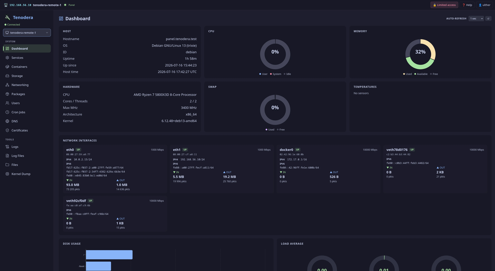

### Services
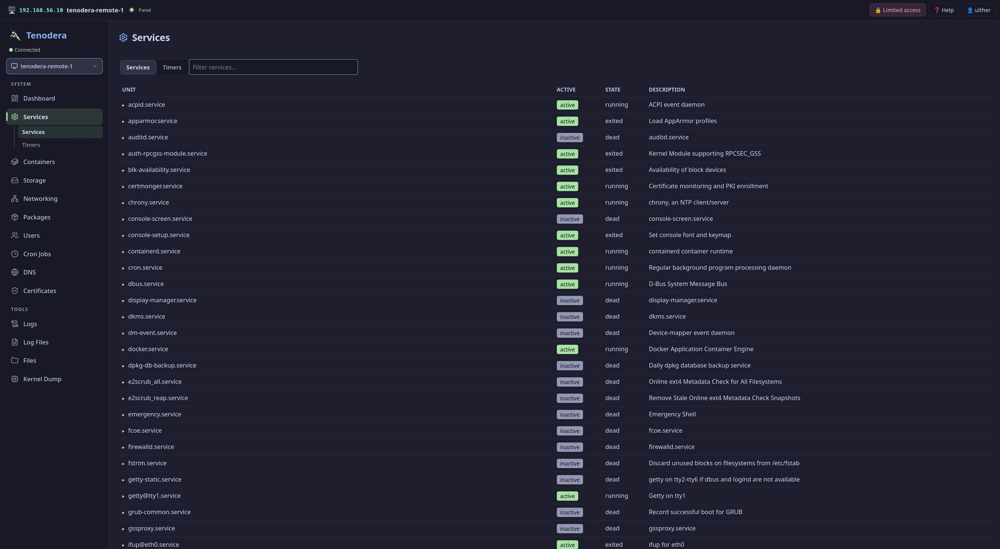

### Containers
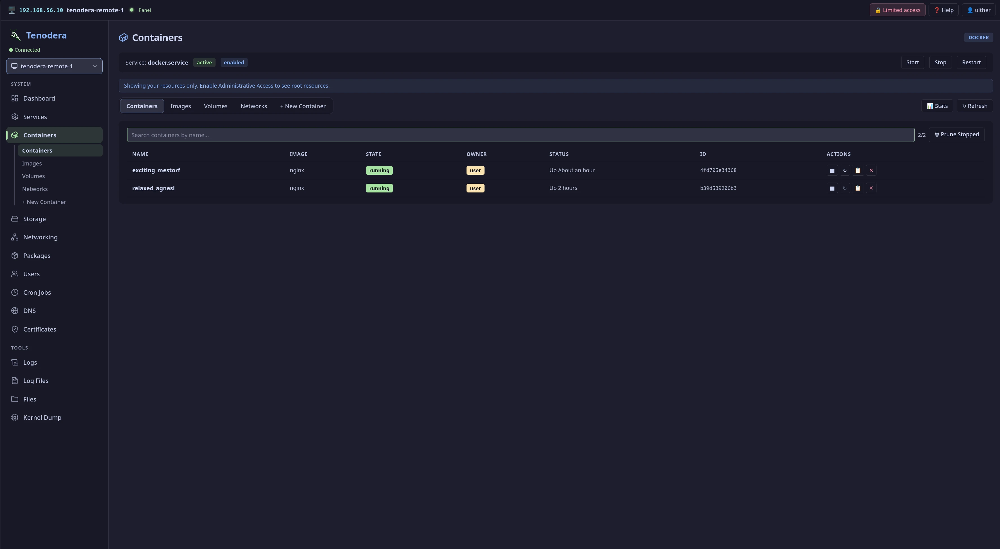

### Storage
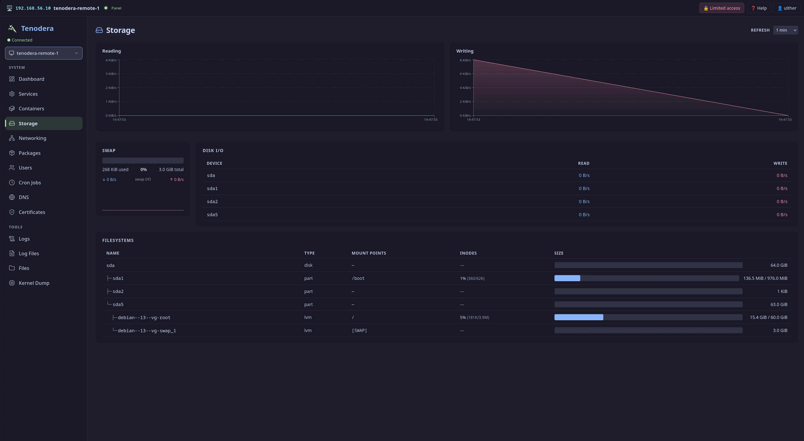

### Networking
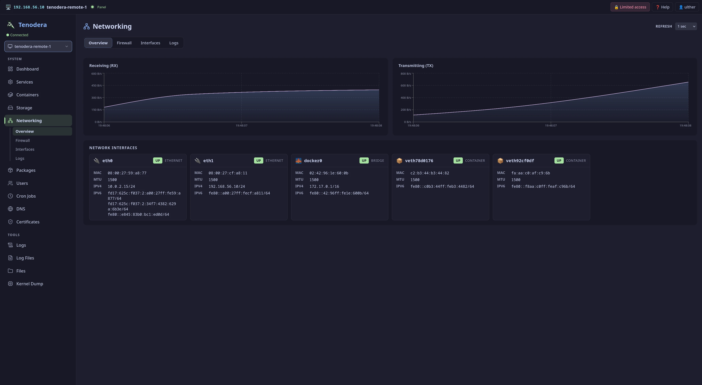

### Packages
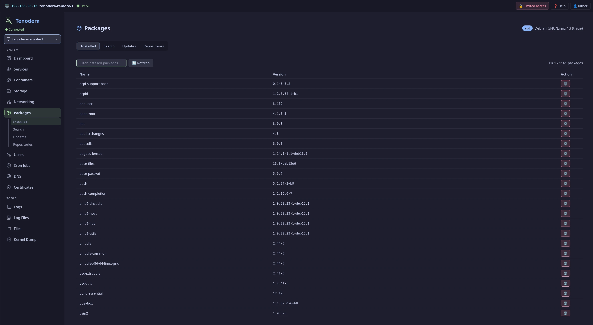

### Users
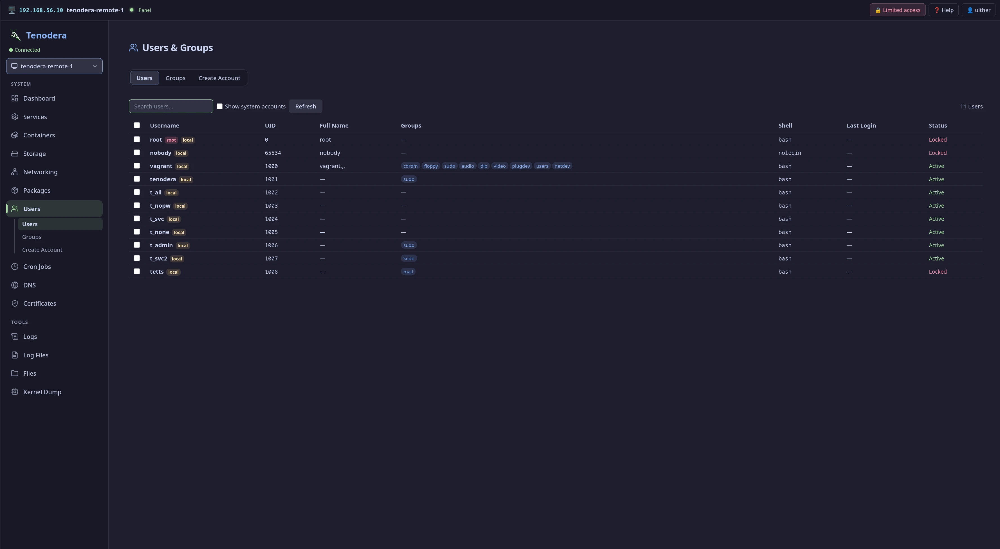

### Cron Jobs
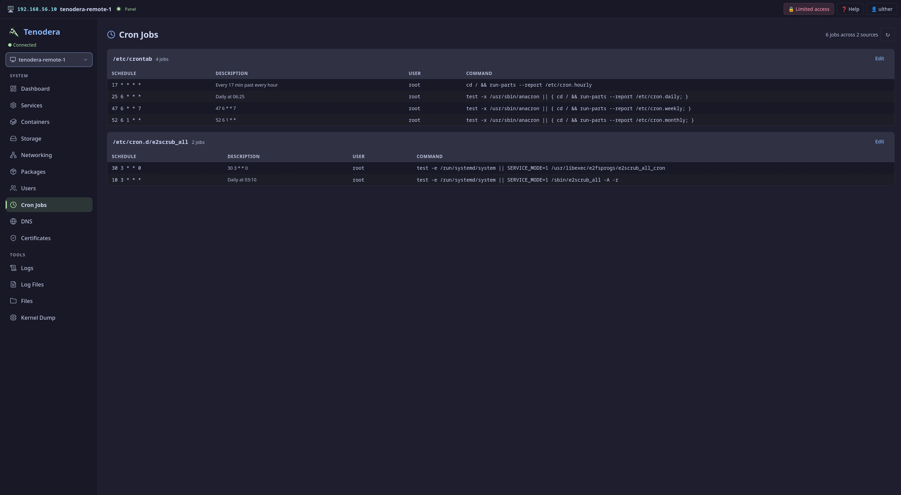

### DNS
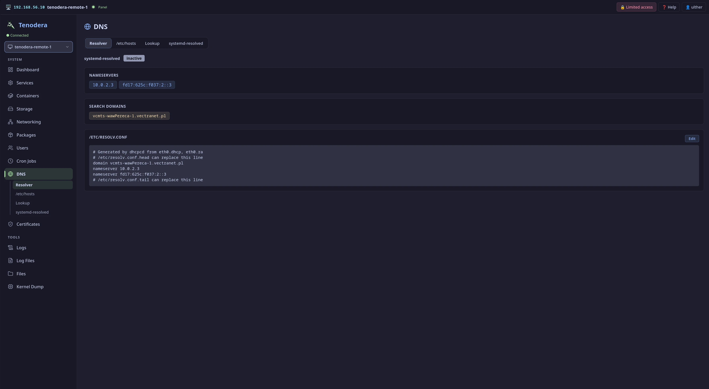

### Certificates
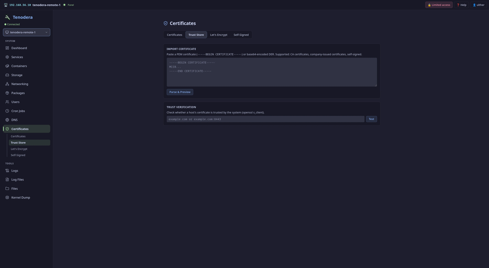

### Journal Logs
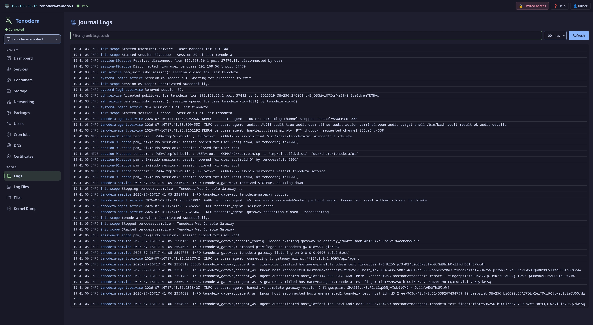

### Log Files
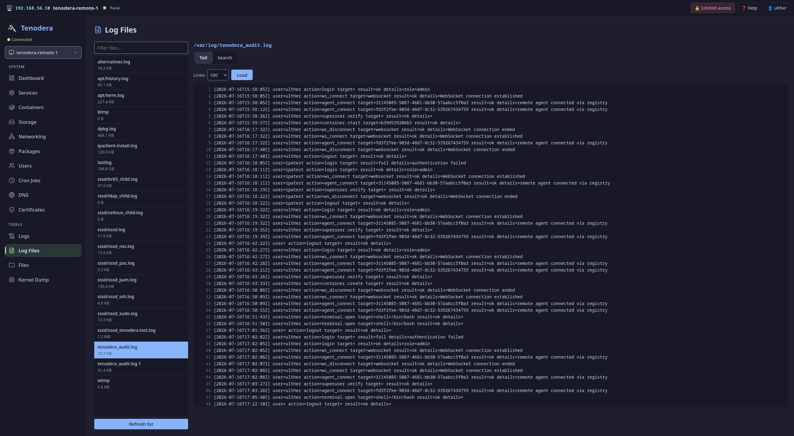

### Files
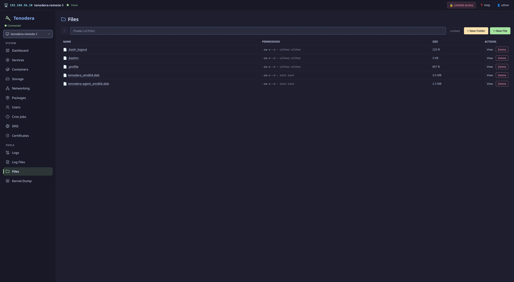

### Terminal
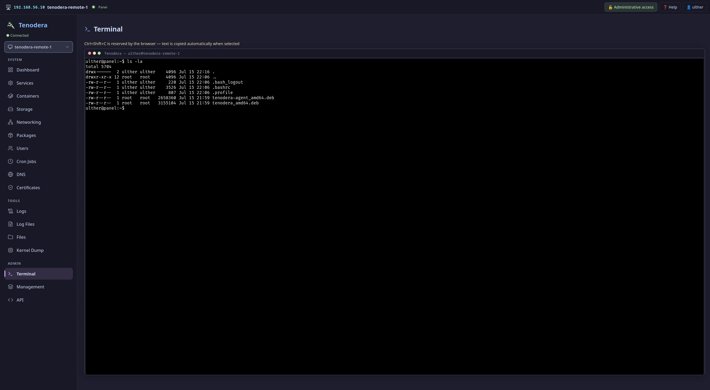

### Management
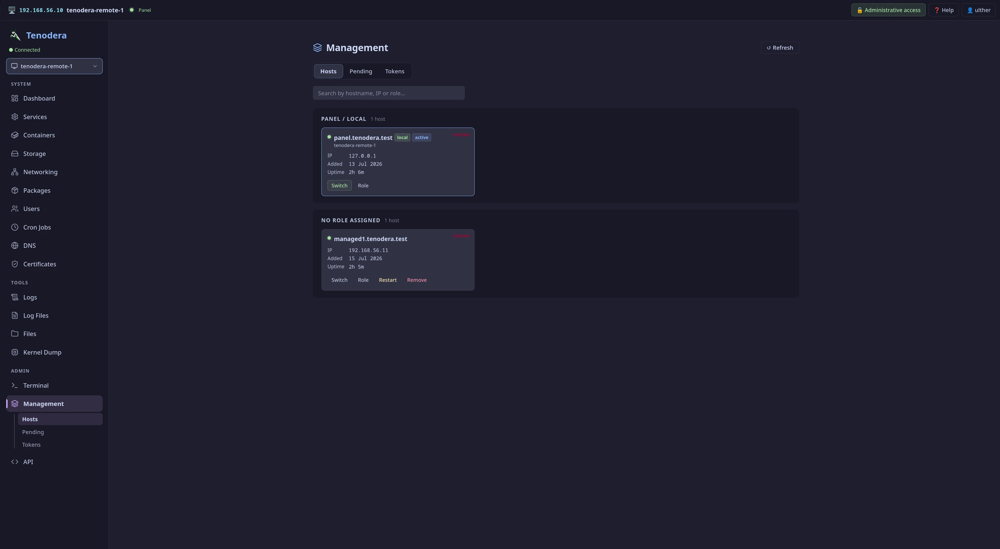

</details>

## License

[MIT](LICENSE)
