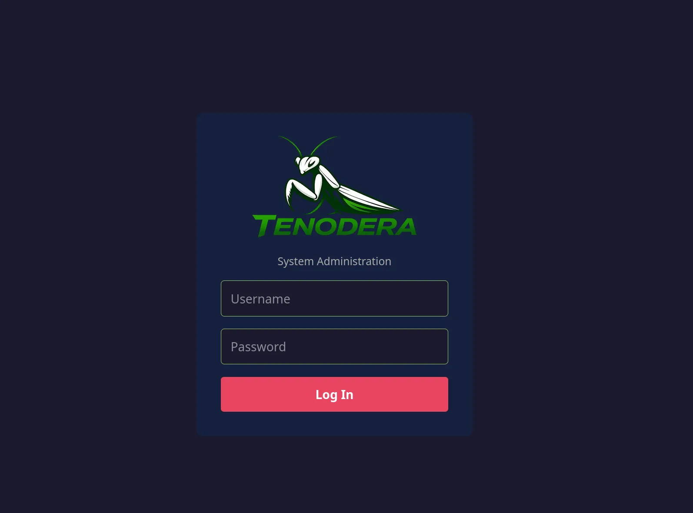
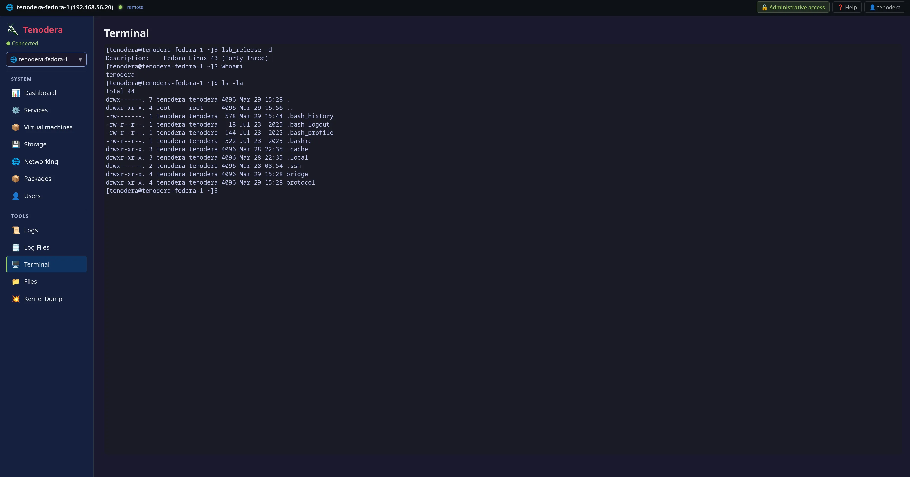
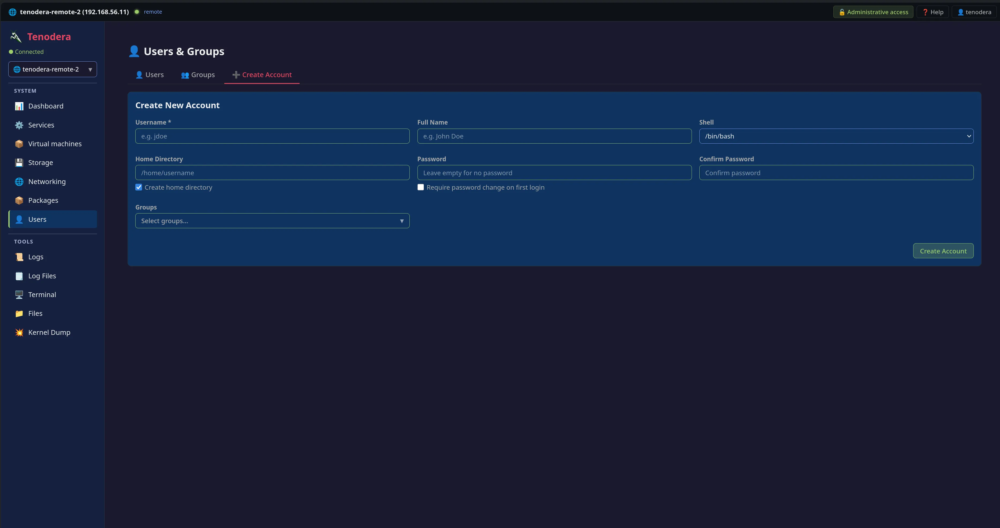
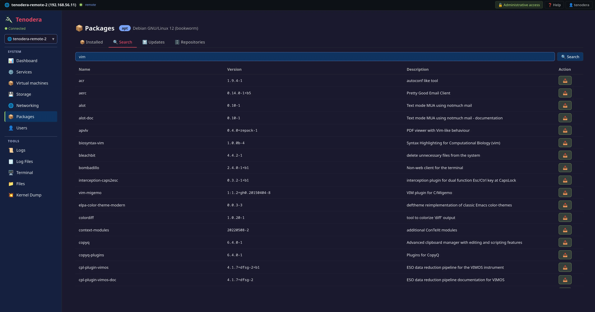
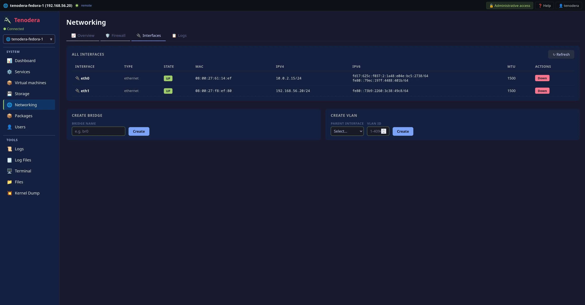
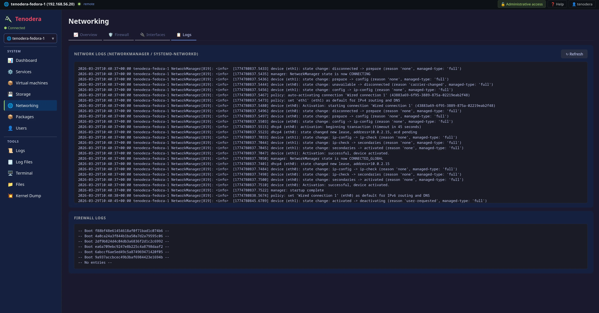
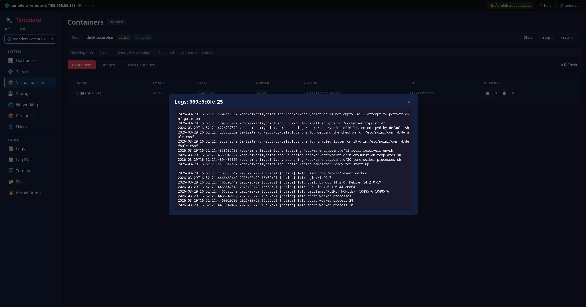

# Tenodera

<p align="center">
  
</p>

A self-hosted Linux server administration panel with real-time monitoring,
terminal access, and multi-host management -- all from a single web interface.

```
Browser ──WS──> Gateway (:9090) <──WS── tenodera-bridge (remote host)
                                 <──WS── tenodera-bridge (localhost)
```

No open inbound ports on managed hosts.
Each bridge connects outbound to the gateway over a persistent WebSocket.


## Features

| Category | Capabilities |
|----------|-------------|
| **Dashboard** | CPU, RAM, swap, disk I/O, network I/O -- real-time streaming charts |
| **Terminal** | Full PTY shell in the browser (xterm.js) |
| **Services** | systemd unit management -- start / stop / restart / enable / disable |
| **Users & Groups** | User account CRUD, group management, lock/unlock, password policy |
| **Packages** | Installed packages, search, install, update, repository management (apt, dnf, pacman) |
| **Storage** | Block devices, mount points, partition usage, I/O charts |
| **Networking** | Interfaces, traffic, firewall (ufw/firewalld/nftables), bridges, VLANs, VPN |
| **Containers** | Docker / Podman -- containers, images, create, logs (user + root) |
| **Files** | Remote file browser with sudo fallback |
| **Logs** | journald viewer with unit/priority filters and timestamps |
| **Log Files** | Browse `/var/log` with keyword search, context lines, date/time range |
| **Kernel Dump** | kdump status, crash kernel config, crash dump browser |
| **Multi-host** | Manage multiple servers from one panel via reverse-WebSocket bridge |
| **Access control** | Role-based: Admin (sudo/wheel users) get full access; non-sudo users get read-only access |

## Install

### Panel (gateway + UI + local bridge)

```bash
curl -sSfL https://raw.githubusercontent.com/ultherego/Tenodera/main/install-panel.sh -o /tmp/install-panel.sh
sudo bash /tmp/install-panel.sh
```

This downloads the source, installs all build dependencies (Rust, Node.js,
system libraries), compiles everything natively, installs binaries and
systemd services, and starts the panel on port 9090.

### Bridge (managed hosts)

Before running this, **add the host in the panel UI** (Admin → Manage Hosts → Add Host).
The UI will display a ready-to-run install command with the correct gateway URL and token.
Copy it and run it on the managed host:

```bash
curl -sSfL https://raw.githubusercontent.com/ultherego/Tenodera/main/install-bridge.sh \
  | sudo bash -s -- --gateway https://<your-panel-host>:9090 --token <token-from-ui>
```

For plaintext HTTP (dev/LAN only):

```bash
curl -sSfL https://raw.githubusercontent.com/ultherego/Tenodera/main/install-bridge.sh \
  | sudo bash -s -- --gateway http://<your-panel-host>:9090 --token <token-from-ui> --accept-insecure
```

The installer builds the bridge binary, writes `/etc/tenodera/bridge.env`, installs a systemd
service, and starts it. The bridge then connects outbound to the gateway — no inbound ports
needed on the managed host.

### Build from source

If you prefer to clone the repo:

```bash
git clone https://github.com/ultherego/Tenodera
cd Tenodera

# Panel (gateway host):
cd panel && sudo make all

# Bridge (managed hosts):
cd bridge && sudo make all
```

### Uninstall

```bash
# Panel (removes gateway, bridge, UI, config, services):
sudo bash install-panel.sh --uninstall

# Bridge only (on managed hosts):
sudo bash install-bridge.sh --uninstall
```

Or from source: `cd panel && sudo make uninstall` / `cd bridge && sudo make uninstall`.

### Bridge configuration

The bridge config lives at `/etc/tenodera/bridge.env` on each managed host:

```bash
TENODERA_GATEWAY_URL=https://<panel-host>:9090   # Gateway WebSocket endpoint
TENODERA_BRIDGE_TOKEN=<uuid>                     # Per-host token (set during install)
```

Edit and restart: `sudo systemctl restart tenodera-bridge`

## Configuration

After install, the gateway config is at:

```
/etc/tenodera/gateway.env
```

Example with all available options:

```bash
# ── Network ──────────────────────────────────────────────
TENODERA_BIND_ADDR=0.0.0.0        # Listen address (default: 0.0.0.0)
TENODERA_BIND_PORT=9090            # Listen port (default: 9090)

# ── External URL (used in bridge install commands shown in the UI) ────────
# Set this if the panel is behind a reverse proxy or has a public hostname.
# Without it, the gateway falls back to the HTTP Host header, then bind addr.
# TENODERA_EXTERNAL_URL=https://panel.example.com

# ── TLS ──────────────────────────────────────────────────
TENODERA_TLS_CERT=/etc/tenodera/tls/cert.pem   # TLS certificate (PEM)
TENODERA_TLS_KEY=/etc/tenodera/tls/key.pem     # TLS private key (PEM)
# TENODERA_ALLOW_UNENCRYPTED=1     # Allow plaintext HTTP (dev only!)

# ── Paths ────────────────────────────────────────────────
TENODERA_BRIDGE_BIN=/usr/local/bin/tenodera-bridge  # Bridge binary path
TENODERA_UI_DIR=/usr/share/tenodera/ui              # Built UI assets

# ── Security ─────────────────────────────────────────────
TENODERA_IDLE_TIMEOUT=900          # Session idle timeout in seconds (default: 900)
TENODERA_MAX_STARTUPS=20           # Max failed logins per IP in 5-min window (default: 20, min: 1)

# ── Logging ──────────────────────────────────────────────
RUST_LOG=tenodera_gateway=info     # Log filter (e.g. debug, info, warn)
```

Edit and restart: `sudo systemctl restart tenodera-gateway`

### TLS (recommended)

The gateway **requires TLS by default**. The quickest way to generate a
self-signed certificate (testing only):

```bash
cd panel && sudo make tls-selfsigned
```

This generates a 10-year self-signed cert in `/etc/tenodera/tls/`, sets the
correct ownership (`root:tenodera-gw`) and permissions (`640`) for the service
user, then restarts the gateway automatically.

To use your own certificate, set in `gateway.env`:

```
TENODERA_TLS_CERT=/etc/tenodera/tls/cert.pem
TENODERA_TLS_KEY=/etc/tenodera/tls/key.pem
```

Ensure both files are readable by the `tenodera-gw` group:

```bash
sudo chown root:tenodera-gw /etc/tenodera/tls/cert.pem /etc/tenodera/tls/key.pem
sudo chmod 640 /etc/tenodera/tls/cert.pem /etc/tenodera/tls/key.pem
```

### Plaintext HTTP (development only)

```
TENODERA_ALLOW_UNENCRYPTED=1
```

> **Warning:** Without TLS, passwords and session tokens are sent in cleartext.

See [SECURITY.md](SECURITY.md) for security recommendations before deploying to production.

## Usage

Log in with any PAM system user on the gateway host. The panel uses system
credentials (local accounts or LDAP/SSSD). Users in the `sudo`, `wheel`, or
`admin` group get **Admin** access (full read/write). All other users are
granted **read-only** access -- they can monitor but cannot execute write
operations.

### Adding remote hosts

1. In the panel UI, open the host selector (top-left) and click **Manage hosts…**
2. Click **Add Host**, enter a name, and copy the generated install command.
3. Paste and run the command on the managed host — it installs the bridge,
   configures it with the correct gateway URL and per-host token, and starts it.

The bridge connects outbound to the gateway. No SSH keys, no open ports on the managed host.

The host appears online in the selector as soon as the bridge connects.
Select it to start managing it.

```bash
# Service management (gateway host)
sudo systemctl status tenodera-gateway
sudo systemctl restart tenodera-gateway
journalctl -u tenodera-gateway -f

# Service management (managed hosts)
sudo systemctl status tenodera-bridge
sudo systemctl restart tenodera-bridge
journalctl -u tenodera-bridge -f
```

### Health endpoints

```
GET /api/health        → { status, sessions, uptime_secs, version }
GET /api/health/ready  → 200 OK | 503 Service Unavailable (bridge binary check)
```

Use `/api/health/ready` as a readiness probe in load balancers or container
orchestration.

## Architecture

```
[ Browser ]
     |
     | WebSocket (channel-multiplexed JSON)
     v
[ Gateway ]   Axum HTTP/WS server, PAM auth, session management
     ^
     |--- reverse WS (outbound from bridge, auth via per-host Bearer token)
     |
[ Bridge ]    lightweight agent, runs as a systemd service on each managed host
     |
     |--- 21 handler modules (system, services, packages, users, terminal, ...)
```

- **Gateway** authenticates users via PAM, manages sessions, serves the
  React UI, and multiplexes user sessions over persistent bridge WebSockets.
- **Bridge** is a long-running agent that connects outbound to the gateway,
  authenticates with its per-host token, and handles system operations via
  channel-multiplexed JSON.
- **Protocol** is a shared Rust crate defining the message types used by
  both gateway and bridge.

No inbound ports need to be opened on managed hosts.
Each bridge maintains a persistent outbound WebSocket to the gateway and
reconnects automatically on disconnect.

The bridge announces its protocol version via a `Hello/HelloAck` handshake on connect.
The gateway validates compatibility and rejects bridges with an incompatible
major version. Current protocol version: **1**.

## Project Structure

```
panel/                   Central server (gateway + UI)
  crates/gateway/        Axum HTTP/WS gateway, PAM auth, reverse-WS bridge registry
  ui/                    React 19 + TypeScript SPA (Vite 6)
  Makefile               Build & install

bridge/                  Standalone bridge binary (deployed to managed hosts)
  src/handlers/          21 handler modules
  Makefile               Build & install

protocol/                Shared message types (Rust library crate)
```

## Screenshots

<details>
<summary>Click to expand screenshots</summary>

### Login


### Dashboard


### Terminal


### Services


### Users


### User Groups


### Create User


### Packages


### Package Search


### Package Repositories


### Storage


### Networking Overview


### Networking Interfaces


### Networking Firewall


### Networking Logs


### Files


### Journal


### Log Files


### Kernel Dump


### Virtual Machines


</details>

## Development

```bash
# Gateway
cd panel && cargo clippy && cargo build

# Frontend (dev server with HMR, proxies /api to :9090)
cd panel/ui && npm ci && npm run dev

# Bridge
cd bridge && cargo clippy && cargo build
```

## License

[MIT](LICENSE)
